# Vehicle Type Classification Using NGSIM US-101 — Engineering Guide

Developed and evaluated supervised machine-learning models for classifying motorcycles, passenger cars, and trucks using the NGSIM US-101 traffic trajectory dataset. Models compared: Logistic Regression, Decision Tree, and Random Forest.

## Visual overview

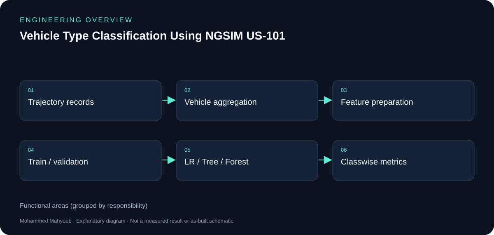

*New explanatory diagram; grouped responsibilities, not an as-built schematic or test result.*

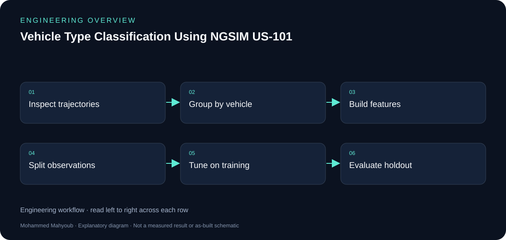

*New explanatory workflow; a documentation aid, not evidence that every proposed check was performed.*

## Why vehicle-level aggregation matters

A vehicle appears in many trajectory frames. Randomly splitting those frames can put the same vehicle into both training and testing. The notebook aggregates records into vehicle observations before modelling so the evaluation unit matches the classification task.

## Features and model choices

Vehicle length and width capture physical dimensions; mean speed, mean acceleration, dominant lane and mean space headway describe traffic behaviour. Logistic Regression, Decision Tree and Random Forest provide contrasting decision boundaries and interpretability.

## Evaluation beyond headline accuracy

Motorcycles, passenger cars and trucks form an imbalanced classification problem. Macro-F1 and classwise recall are needed alongside accuracy. The dimensions-only versus full-feature comparison asks how much behaviour adds beyond vehicle size. Numerical results belong to the notebook outputs and should retain their experimental context.

## Reproducibility

The repository contains the Jupyter notebook and requirements.txt. Run it with the original dataset paths reviewed first; preserve vehicle identity boundaries during train/test preparation and tuning. The Zenodo DOI identifies the archived research output, while GitHub contains the current documentation.

## Evidence to review or collect

The following are suggested review checks. A checklist entry is not a claimed pass result.

- Vehicle identities separated across splits.
- Feature definitions and missing-value handling.
- Training-only model selection.
- Classwise confusion matrix and ablation results.

## Source gallery

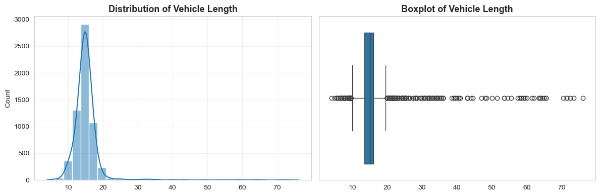

*notebook figure 01 — embedded output extracted from the public notebook; retain the notebook context.*

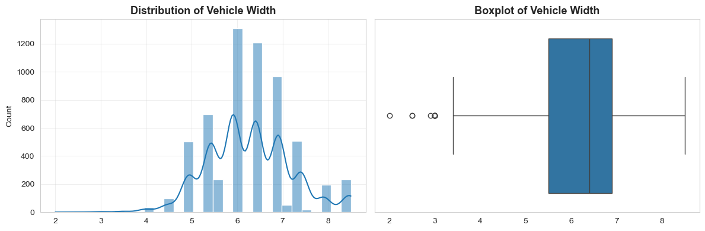

*notebook figure 02 — embedded output extracted from the public notebook; retain the notebook context.*

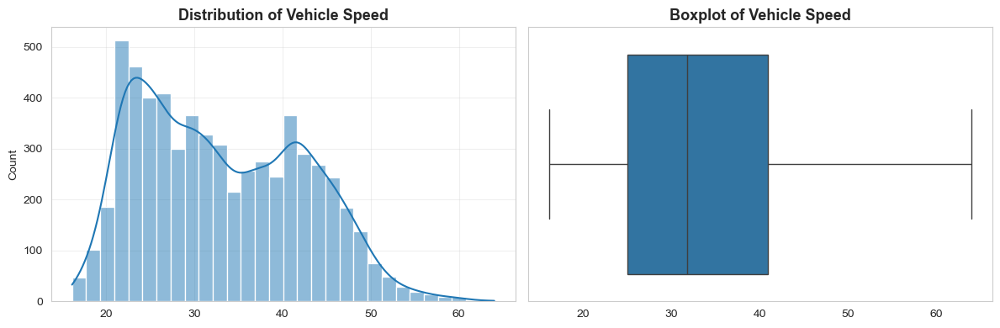

*notebook figure 03 — embedded output extracted from the public notebook; retain the notebook context.*

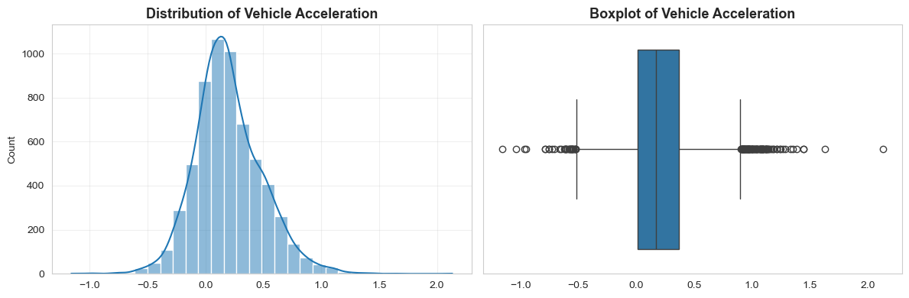

*notebook figure 04 — embedded output extracted from the public notebook; retain the notebook context.*

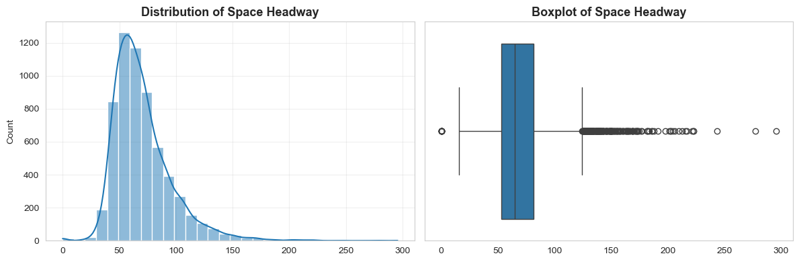

*notebook figure 05 — embedded output extracted from the public notebook; retain the notebook context.*

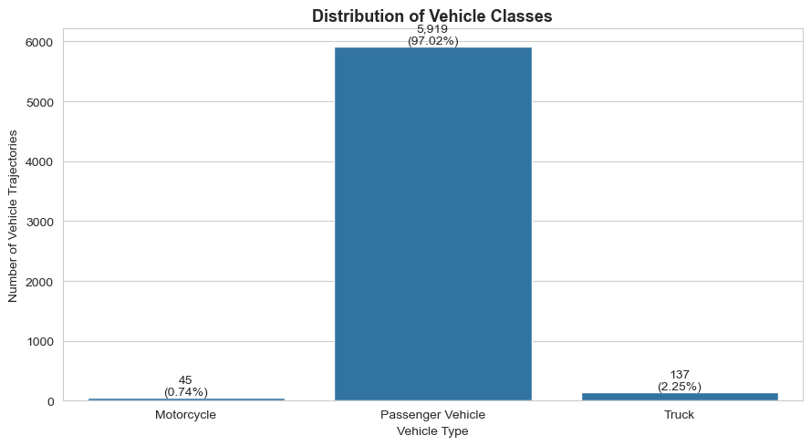

*notebook figure 06 — embedded output extracted from the public notebook; retain the notebook context.*

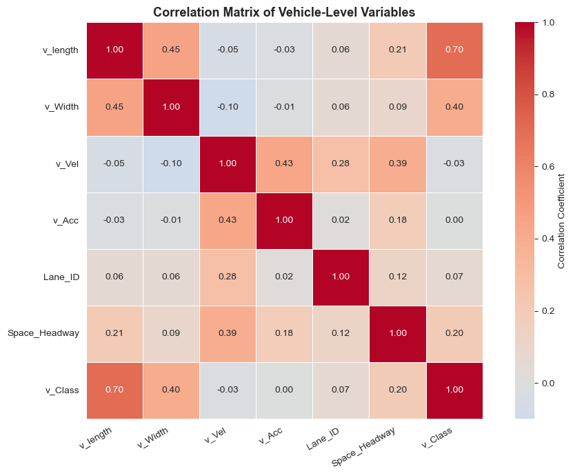

*notebook figure 07 — embedded output extracted from the public notebook; retain the notebook context.*

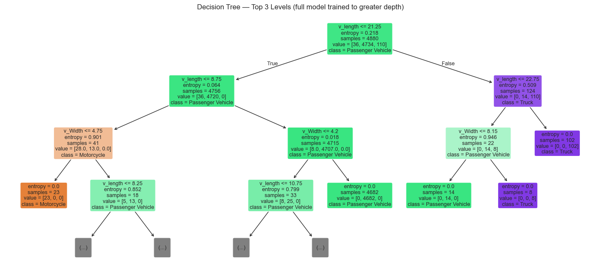

*notebook figure 08 — embedded output extracted from the public notebook; retain the notebook context.*

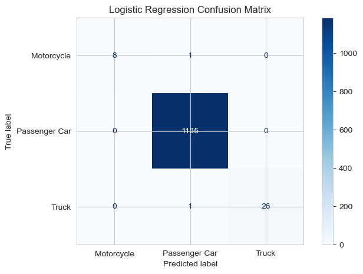

*notebook figure 09 — embedded output extracted from the public notebook; retain the notebook context.*

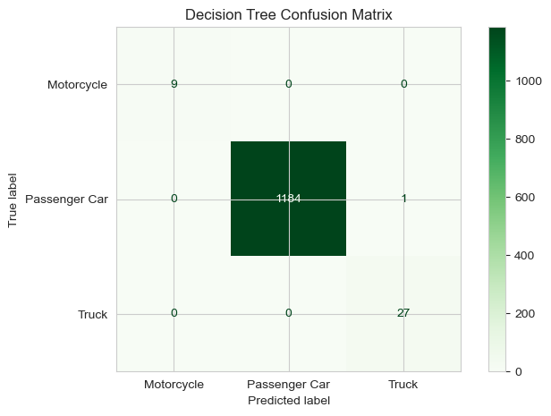

*notebook figure 10 — embedded output extracted from the public notebook; retain the notebook context.*

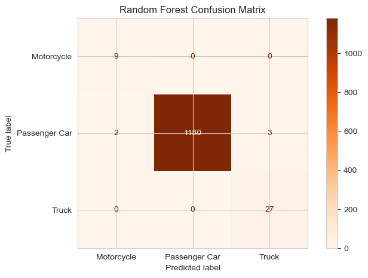

*notebook figure 11 — embedded output extracted from the public notebook; retain the notebook context.*

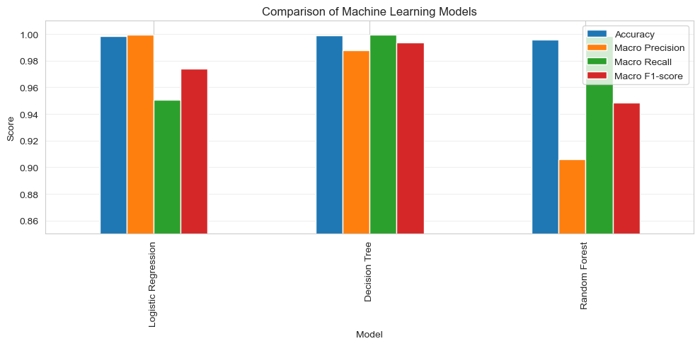

*notebook figure 12 — embedded output extracted from the public notebook; retain the notebook context.*

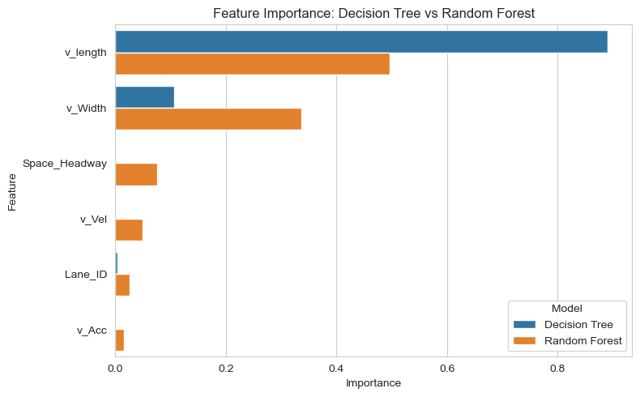

*notebook figure 13 — embedded output extracted from the public notebook; retain the notebook context.*

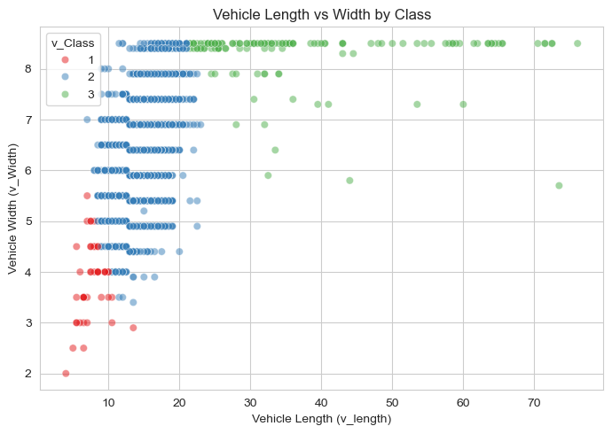

*notebook figure 14 — embedded output extracted from the public notebook; retain the notebook context.*

## Sources and provenance

- [Published portfolio description](https://mahyoub88.github.io/#proj-ngsim).
- [Project README](../README.md) and existing repository files.
- [LinkedIn projects](https://www.linkedin.com/in/mohammed-mahyoub/details/projects/): supplementary descriptions and project media.
- New SVG figures and explanatory text were authored for this documentation update; they are not original photographs or new measured results.
